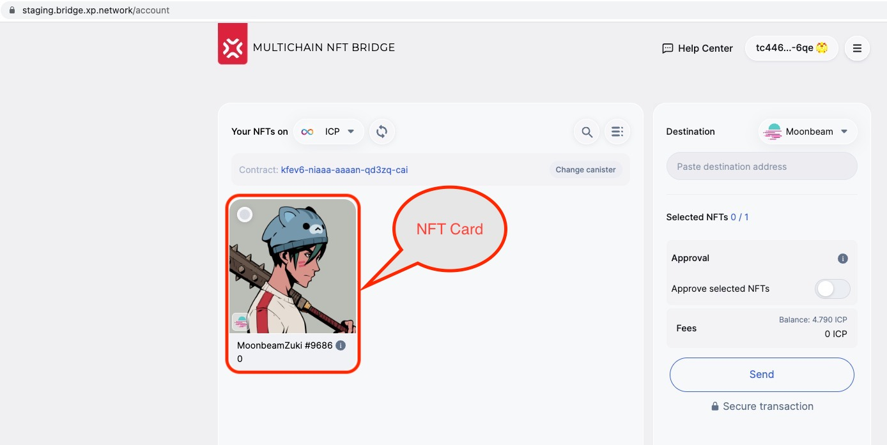
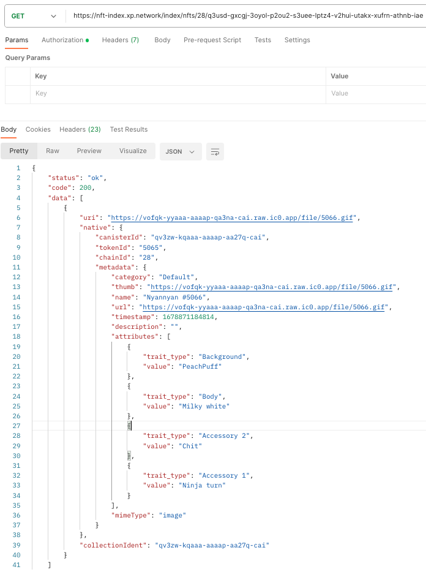
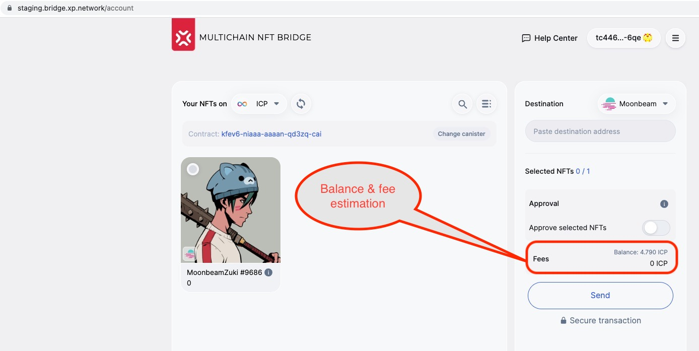
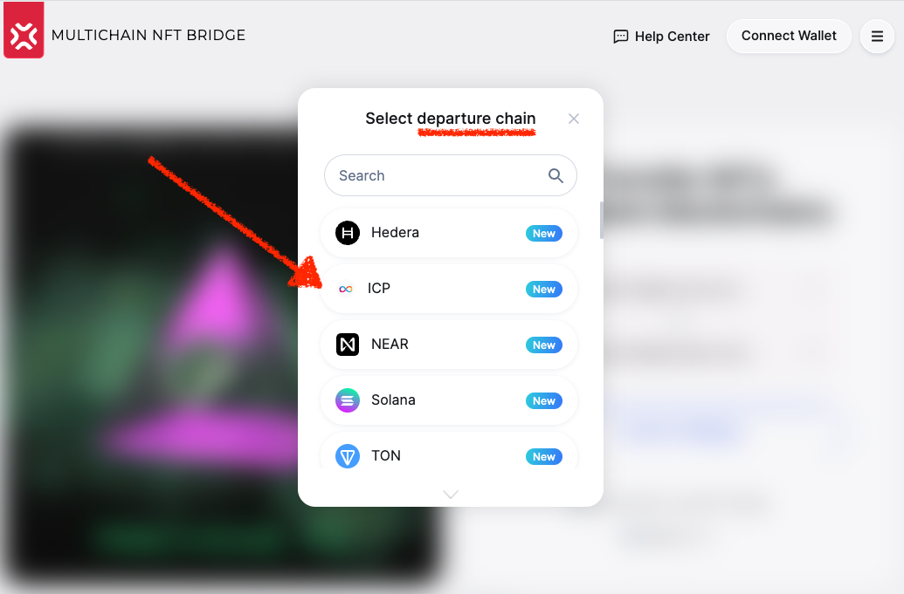
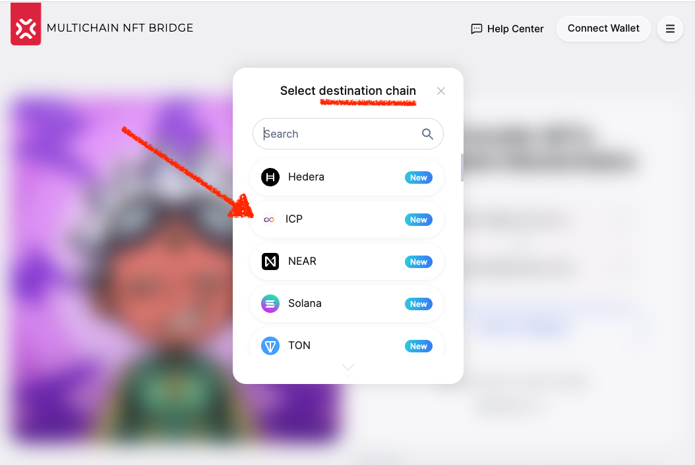

# Milestone 4 Proofs

To keep the milestone delivery page clean, all the proofs and links have been moved to the present page.

## 4.1. Validators work

The best proof of the validator's work are successful mainnet transactions:

|From|To|Hash|
|:-:|:-:|:-:|
|Moonbeam|ICP|[Link](https://moonbeam.moonscan.io/tx/0x8deaa783ca8754d7cd8277b27051099f29af55892466b694e35e759923e5a96b)|
|ICP|Moonbeam|[Link](https://explorer.xp.network/tx/3)

## 4.2. NFT Indexer

NFT indexer can be demonstrated in 2 ways:

### 4.2.1. NFT Indexing in the UI (example):



### 4.2.2. In API (example):

```url
https://nft-index.xp.network/index/nfts/28/q3usd-gxcgj-3oyol-p2ou2-s3uee-lptz4-v2hui-utakx-xufrn-athnb-iae
```



## 4.3. Transaction fee estimation



## 4.4 Heartbeat

Heartbeat is a tool monitoring liveliness of the chain nodes, and the bridge validators. If the nodes are not responsive or the number of the active validators is below the threshold, the blockchain is automatically disable in the bridge & the widget UI to avoid errors or stuck assets.

Link: https://bridgestatus.herokuapp.com/status

The internal bridge chain nonce for Dfinity is [28](https://docs.xp.network/docs/Multibridge2.0/chain_nonces)

## 4.5 Integrated nodes:

https://github.com/XP-NETWORK/xpjs/blob/secretjs/src/factory/factories.ts#L113

## 4.6 ICP in the Bridge UI

URL: https://staging.bridge.xp.network/

ICP is available as a chain of departure:



And the chain of destination:



## 4.7 Deployed mainnet contracts

https://github.com/XP-NETWORK/xpjs/blob/secretjs/src/factory/factories.ts#L115-L117


[link](#48-dfinity-in-xpjs)

## 4.8 Dfinity in xpjs

https://github.com/XP-NETWORK/xpjs/search?q=dfinity

## 4.9 ICP in the Widget

URL: https://widget-staging.xp.network/

